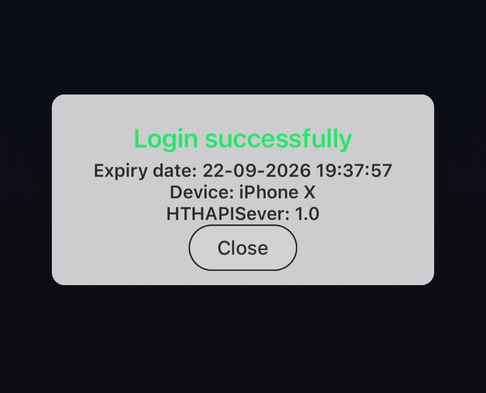
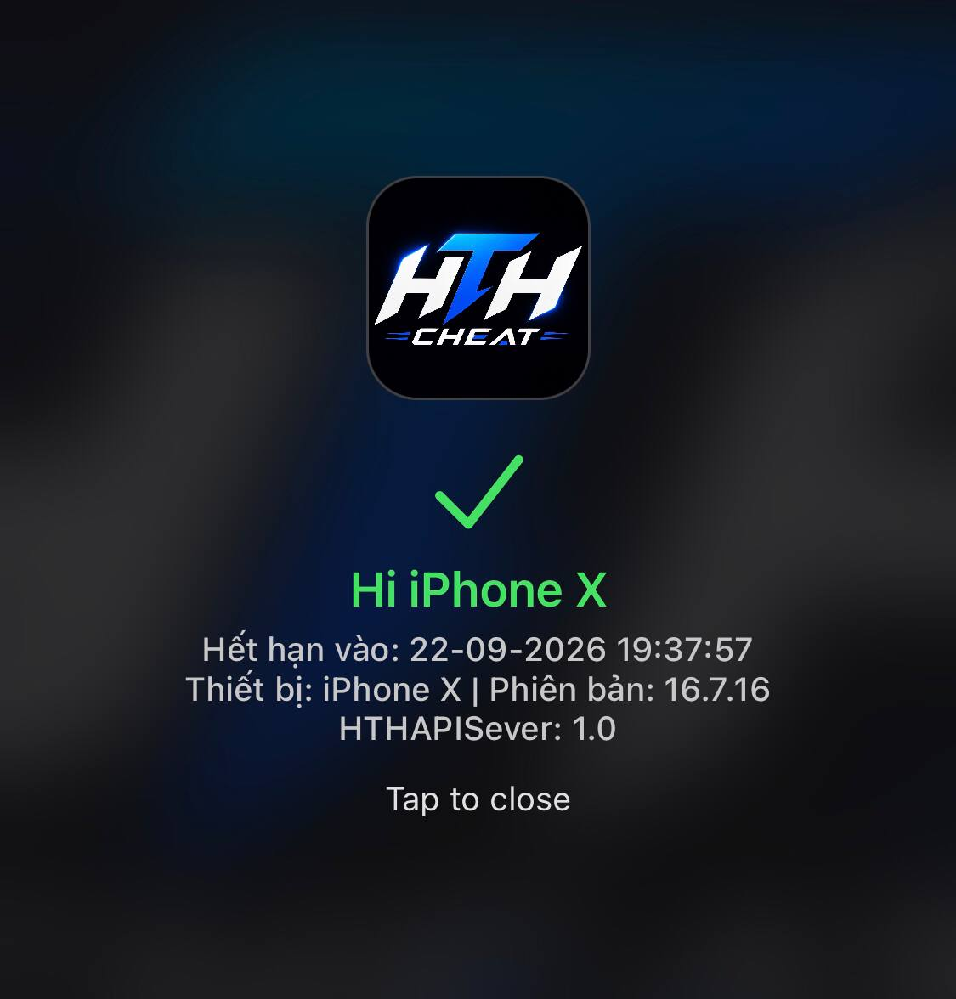

# Hướng dẫn thêm HTH APIKEY vào project
### Professional License Management & Authentication Framework

[](https://github.com/hthapikey/APIKEYHTHV1)
[](https://www.apple.com/ios)
[](LICENSE)
[](https://theos.dev)

ApiKeyHTH.h
libapikeyhth.a

## 1. Thêm hai file vào project

Chép `ApiKeyHTH.h` và `libapikeyhth.a` vào một thư mục bất kỳ trong
project, ví dụ:

```text
Project/
└── API/
    ├── ApiKeyHTH.h
    └── libapikeyhth.a
```

Thêm đường dẫn header, static library và các framework cần thiết vào cấu
hình build của project.

Ví dụ với Theos, thay `TARGET_NAME` bằng tên application hoặc tweak:

```makefile
TARGET_NAME = $(APPLICATION_NAME)
# Nếu build tweak/.dylib:
# TARGET_NAME = $(TWEAK_NAME)

$(TARGET_NAME)_CFLAGS += -I$(THEOS_PROJECT_DIR)/API
$(TARGET_NAME)_CCFLAGS += -std=c++17
$(TARGET_NAME)_LDFLAGS += $(THEOS_PROJECT_DIR)/API/libapikeyhth.a
$(TARGET_NAME)_LDFLAGS += -lc++ -lsqlite3
$(TARGET_NAME)_FRAMEWORKS += CoreFoundation CoreGraphics CoreServices \
    QuartzCore IOKit UIKit CoreText Security AVKit AVFoundation \
    CoreMedia CFNetwork
```

File gọi API bằng Objective-C phải có đuôi `.mm`.

## 2. Gọi API tại file cần mở menu

```objc
#import "API/ApiKeyHTH.h"

static void OpenMenuWithLicense(void) {
    [apikeyios configureWithPackageToken:@"TOKEN_CUA_PACKAGE"];
    [apikeyios setPackageVersion:@"1.0.0"];

    [apikeyios paid:^{
        dispatch_async(dispatch_get_main_queue(), ^{
            if (![apikeyios isLicenseValid]) return;
            if (apikey_quick_validate() != 1) return;

            // Gọi menu hoặc chức năng chính tại đây.
            // OpenMenu();
        });
    }];
}
```

Thay:

- `TOKEN_CUA_PACKAGE` bằng token package trên server.
- `1.0.0` bằng version package trên server.
- `OpenMenu()` bằng hàm mở menu hoặc hàm chính của project.

Chỉ gọi menu sau khi callback thành công và kiểm tra license trả về hợp lệ.

## 3. Nếu file gọi là C++

```cpp
#include "API/ApiKeyHTH.h"

void OpenMenuWithLicense() {
    HTHApiKey::configure("TOKEN_CUA_PACKAGE", "1.0.0");

    HTHApiKey::paid([] {
        if (!HTHApiKey::isLicenseValid()) return;
        if (hth_apikey_quick_validate() != 1) return;

        // Gọi menu hoặc chức năng chính tại đây.
    });
}
```

## 4. Lấy thông tin tài khoản

Objective-C++:

```objc
NSString *key         = [apikeyios getKey];
NSString *expiryDate  = [apikeyios getExpiryDate];
NSString *udid        = [apikeyios getUDID];
NSString *deviceModel = [apikeyios getDeviceModel];
NSString *loginIP     = [apikeyios getLoginIP];
NSString *packageName = [apikeyios getPackageName];
```

C++:

```cpp
std::string key         = HTHApiKey::getKey();
std::string expiryDate  = HTHApiKey::getExpiryDate();
std::string udid        = HTHApiKey::getUDID();
std::string deviceModel = HTHApiKey::getDeviceModel();
std::string loginIP     = HTHApiKey::getLoginIP();
std::string packageName = HTHApiKey::getPackageName();
```
Để hiển thị ảnh trong file Markdown, bạn cần sử dụng cú pháp: ``.

Dưới đây là toàn bộ mã nguồn Markdown hoàn chỉnh (bạn có thể copy toàn bộ nội dung trong khung này và dán vào file `.md` của mình):

```markdown
# Hướng dẫn thêm HTH APIKEY vào project

ApiKeyHTH.h[cite: 1]
libapikeyhth.a[cite: 1]

## 1. Thêm hai file vào project

Chép `ApiKeyHTH.h` và `libapikeyhth.a` vào một thư mục bất kỳ trong project, ví dụ[cite: 1]:

```text
Project/
└── API/
    ├── ApiKeyHTH.h
    └── libapikeyhth.a

```

Thêm đường dẫn header, static library và các framework cần thiết vào cấu hình build của project.

Ví dụ với Theos, thay `TARGET_NAME` bằng tên application hoặc tweak:

```makefile
TARGET_NAME = $(APPLICATION_NAME)
# Nếu build tweak/.dylib:
# TARGET_NAME = $(TWEAK_NAME)

$(TARGET_NAME)_CFLAGS += -I$(THEOS_PROJECT_DIR)/API$(TARGET_NAME)_CCFLAGS += -std=c++17
$(TARGET_NAME)_LDFLAGS +=$(THEOS_PROJECT_DIR)/API/libapikeyhth.a
$(TARGET_NAME)_LDFLAGS += -lc++ -lsqlite3$(TARGET_NAME)_FRAMEWORKS += CoreFoundation CoreGraphics CoreServices \
    QuartzCore IOKit UIKit CoreText Security AVKit AVFoundation \
    CoreMedia CFNetwork

```

File gọi API bằng Objective-C phải có đuôi `.mm`.

## 2. Gọi API tại file cần mở menu

```objc
#import "API/ApiKeyHTH.h"

static void OpenMenuWithLicense(void) {
    [apikeyios configureWithPackageToken:@"TOKEN_CUA_PACKAGE"];
    [apikeyios setPackageVersion:@"1.0.0"];

    [apikeyios paid:^{
        dispatch_async(dispatch_get_main_queue(), ^{
            if (![apikeyios isLicenseValid]) return;
            if (apikey_quick_validate() != 1) return;

            // Gọi menu hoặc chức năng chính tại đây.
            // OpenMenu();
        });
    }];
}

```

Thay:

* `TOKEN_CUA_PACKAGE` bằng token package trên server.


* `1.0.0` bằng version package trên server.


* `OpenMenu()` bằng hàm mở menu hoặc hàm chính của project.


Chỉ gọi menu sau khi callback thành công và kiểm tra license trả về hợp lệ.

## 3. Nếu file gọi là C++

```cpp
#include "API/ApiKeyHTH.h"

void OpenMenuWithLicense() {
    HTHApiKey::configure("TOKEN_CUA_PACKAGE", "1.0.0");

    HTHApiKey::paid([] {
        if (!HTHApiKey::isLicenseValid()) return;
        if (hth_apikey_quick_validate() != 1) return;

        // Gọi menu hoặc chức năng chính tại đây.
    });
}

```

## 4. Lấy thông tin tài khoản

Objective-C++:

```objc
NSString *key         = [apikeyios getKey];
NSString *expiryDate  = [apikeyios getExpiryDate];
NSString *udid        = [apikeyios getUDID];
NSString *deviceModel = [apikeyios getDeviceModel];
NSString *loginIP     = [apikeyios getLoginIP];
NSString *packageName = [apikeyios getPackageName];

```

C++:

```cpp
std::string key         = HTHApiKey::getKey();
std::string expiryDate  = HTHApiKey::getExpiryDate();
std::string udid        = HTHApiKey::getUDID();
std::string deviceModel = HTHApiKey::getDeviceModel();
std::string loginIP     = HTHApiKey::getLoginIP();
std::string packageName = HTHApiKey::getPackageName();

```

---

## 5. Các chủ đề giao diện

Dưới đây là một số hình ảnh minh họa cho các chủ đề giao diện được hỗ trợ:

HTHAPIKey 1.0 **Full** bao gồm 3 chủ đề chuyên nghiệp để tùy chỉnh giao diện của bạn:

<div align="center">

|                                          |                          |                                      |
| :--------------------------------------: | :----------------------: | :----------------------------------: |
|               **LoginSuccess**           |         **AppIconGlow**  |              **Login Motion**        |
|      | |              |


</div>


## 6. Thông tin liên hệ

Nếu bạn cần hỗ trợ, vui lòng liên hệ qua các kênh sau:

* **Telegram:** [Contact me](https://t.me/hatronghoann)
* **Zalo:** [Tại đây](https://www.google.com/search?q=https://zalo.me/0963671028)

## 7. Bản quyền thuộc về
```
Copyright © 2025-2026 Hà Trọng Hoàn (@hatronghoann)

```
